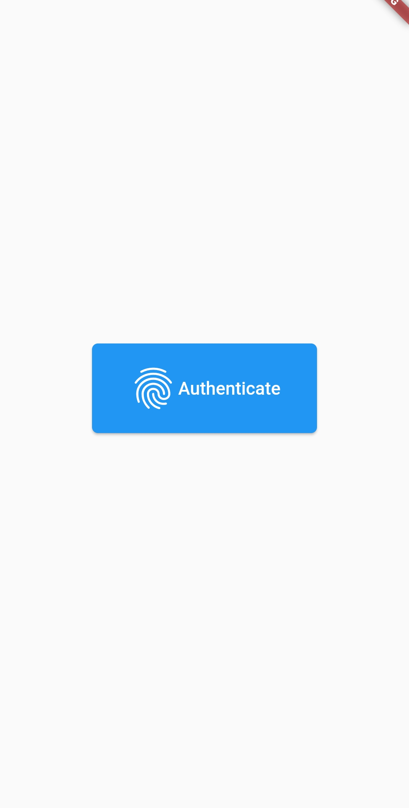
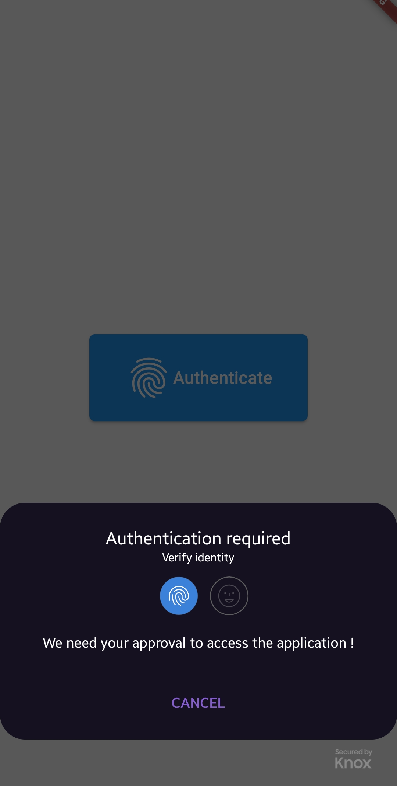
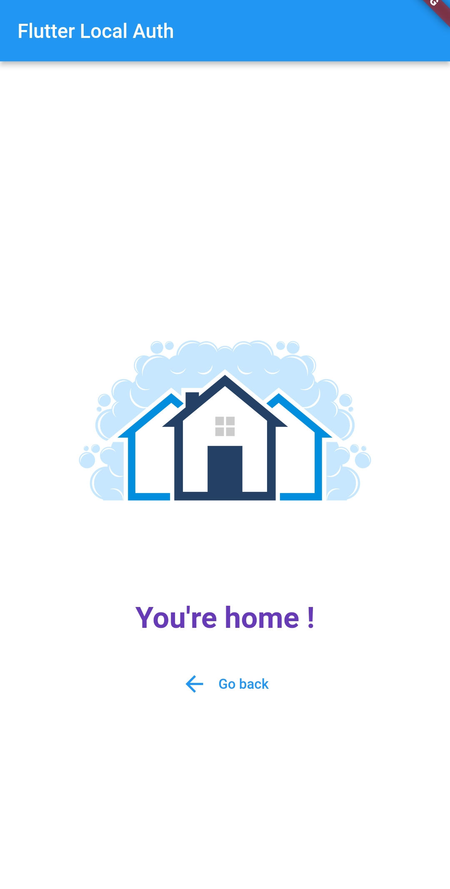

# flutter_local_auth

Flutter `Biometric` authentication using [local_auth](https://pub.dev/packages/local_auth) package.

# 1. <u>**Auth**</u>

<center>

<div style="display: flex;">





</div>

</center>

<br>
<br>

# 2. <u>**Home**</u>



<br>

## How to:

```sh
git clone https://github.com/DroidZed/flutter_local_auth.git
```

- `$ flutter pub get`
- `$ flutter run`

The packages are already configured for you. Ne need for more configuration.
